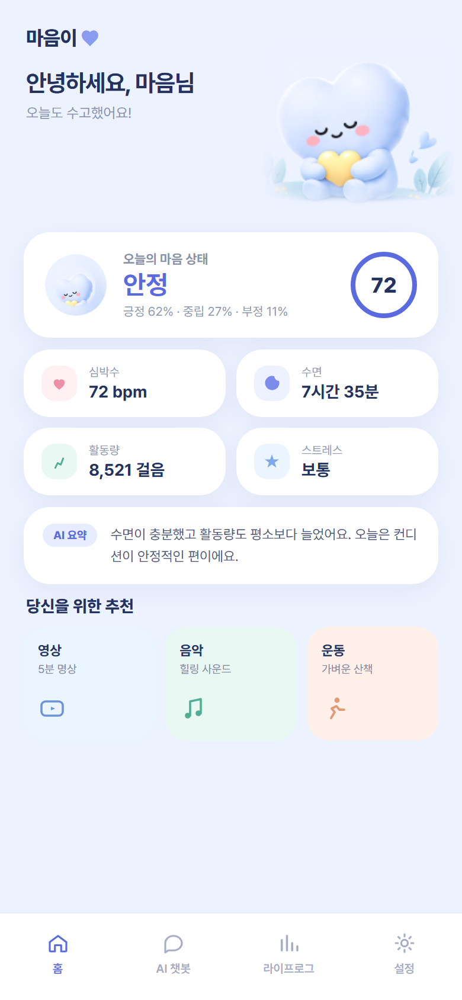
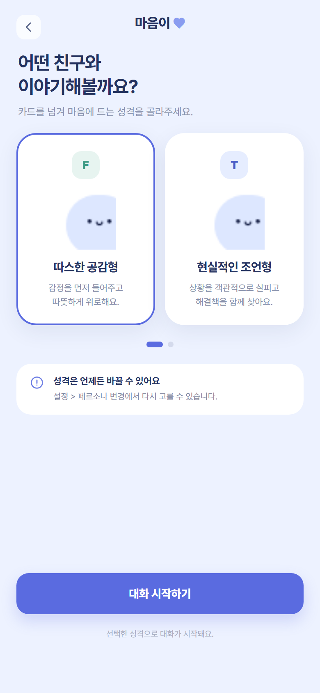
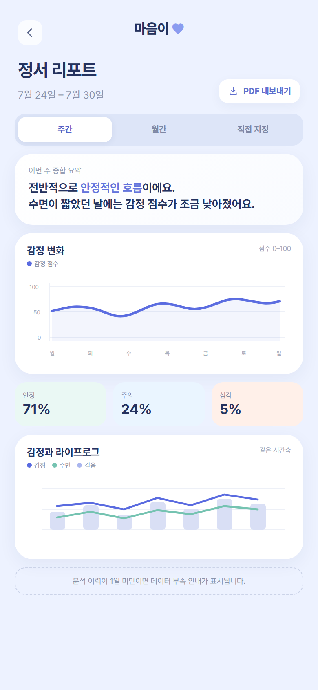
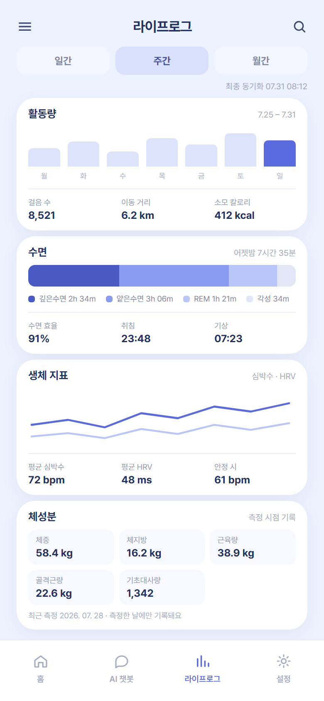
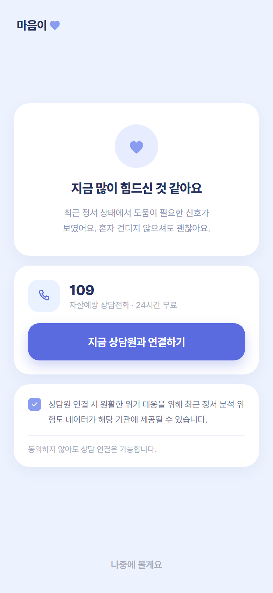
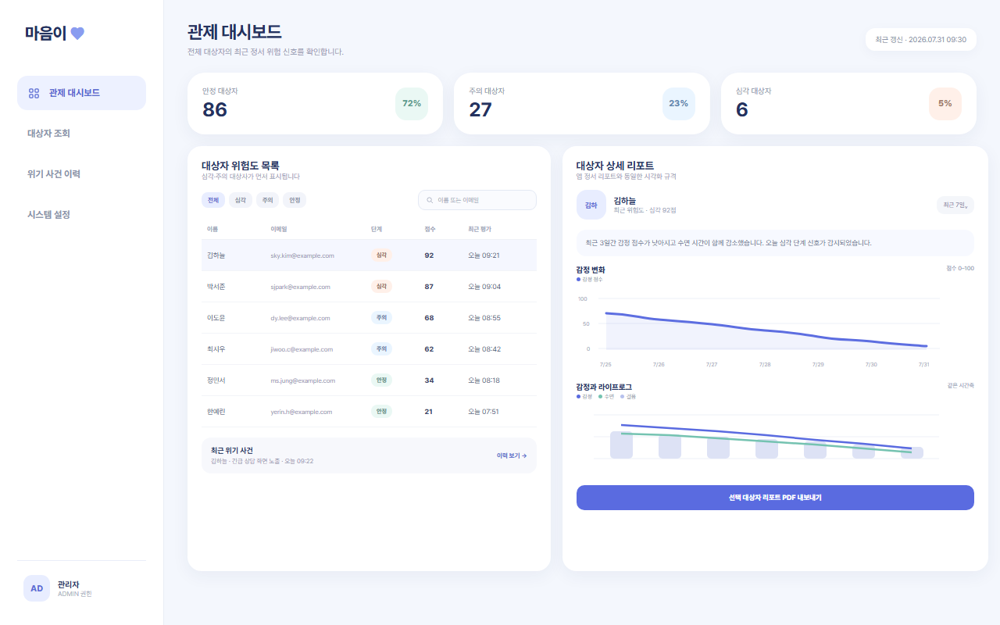

# 귀기울임 (LISN)

**멀티모달 라이프로그 감정 분석 기반 맞춤형 LLM 케어 및 모니터링 시스템**

> **최종 점검** 2026.08.06 · API 33개 · 앱 화면 13개 · 관리자 웹 2개가 전부 연동돼
> **수집 → 분석 → 케어 → 관제 전 구간이 관통합니다.** 회귀 테스트 213건.
> 화면설계서 21장과 구현이 **대조 완료**돼 어긋난 6건을 모두 맞췄고,
> 코드 전수 점검으로 **결함 14건**을 해소했습니다.
>
> 남은 것은 **위기 판정 평가셋 검수·채점**(200건 중 180건이 AI 초안),
> **Health Connect 실기기 검증**, `SD-B①` 문서 개정입니다. 정서 판정은
> **규칙 기반 임시값**입니다(아래 「현재 구현 상태」).

Multi-modal Lifelog Emotion Care & Monitoring System — wearable lifelog deviation analysis with persona-based LLM care and two-stage crisis detection | Flutter · FastAPI · PostgreSQL

스마트워치·체성분계에서 자동 수집되는 라이프로그 시계열을 AI로 분석해 1인가구의 정서적 위험 징후를 조기에 탐지하고, 페르소나 기반 LLM 챗봇으로 정서 케어를 제공하는 모니터링 서비스입니다.

> 본 서비스는 정신건강 상태를 진단하거나 의학적으로 확정하지 않습니다.
> 행동·생체 패턴의 변화를 관찰해 정서적 위험 징후의 가능성을 조기에 포착하고,
> 적절한 케어·상담 연계를 지원하는 **모니터링 보조 도구**입니다.

- **팀** 귀기울임 (스마트인재개발원 KDT 헬스케어 5팀) · 기업주제(라라랩스)
- **기간** 2026.07.17 ~ 2026.08.28 · **최종 발표** 2026.08.28

---

## 빠른 시작

```powershell
git clone https://github.com/2026-SMHRD-KDT-HealthCare-5/lisn.git
cd lisn
```

#### 1. DB 먼저 — `start-dev.ps1` 은 DB 를 만들지 않습니다

새 PC 라면 이걸 건너뛸 수 없습니다. **한 줄씩이 아니라 아래 블록을 통째로**
붙여넣으세요. `$psql` 과 `PGCLIENTENCODING` 이 뒤 명령에 이어져야 합니다.

```powershell
$psql = "C:\Program Files\PostgreSQL\17\bin\psql.exe"
$env:PGCLIENTENCODING = 'UTF8'
& $psql -U postgres -c "CREATE DATABASE lisn;"
& $psql -U postgres -d lisn -f db\schema.sql
& $psql -U postgres -d lisn -f db\seed_healing_contents.sql
& $psql -U postgres -d lisn -f db\seed_demo_persona.sql
```

- **전체 경로로 부르는 것은 의도한 것입니다.** PostgreSQL 설치 프로그램은 `bin` 을
  PATH 에 등록하지 않아 `psql` 만 치면 「인식할 수 없습니다」가 납니다
- **`PGCLIENTENCODING` 을 빼지 마세요.** 한글 Windows 콘솔(코드페이지 949)에서는
  psql 이 `client_encoding=UHC` 로 붙어 UTF-8 인 `db/*.sql` 을 읽다 깨집니다
- **순서를 지키세요.** 시드를 스키마보다 먼저 넣으면 「`users` 릴레이션이 없습니다」

#### 2. `.env` 채우기

```powershell
Copy-Item backend\.env.example backend\.env
```

`DATABASE_URL` · `JWT_SECRET` · `ENCRYPTION_KEY` 를 채웁니다. 생성 명령은 아래
[안 뜨면 — 증상별로 여기를 보세요](#안-뜨면--증상별로-여기를-보세요) 의
`JWT_SECRET` 항목에 있습니다.

> ⚠ **`CHANGE_ME` 로 두면 서버가 토큰 발급을 거부합니다.** 백엔드는 멀쩡히 뜨는데
> 로그인만 안 됩니다.

#### 3. 실행

```powershell
.\tools\start-dev.ps1
```

**이 한 줄이면 됩니다.** 백엔드 · AI 추론 서버 · 관리자 웹 · Flutter 가 각각
새 창에 뜹니다.

| 뜨는 것 | 주소 | 여기서 뭘 보나 |
|---|---|---|
| 백엔드 API | http://localhost:8000/docs | Swagger. **API 명세 정본**입니다. 여기서 바로 호출해 볼 수 있습니다 |
| 관리자 관제 웹 | http://localhost:5173 | 위험도 분포 · 대상자 검색 · 위기 이력. **`ADMIN` 계정만** 들어갑니다 |
| AI 추론 서버 | http://localhost:8001/health | 살아 있는지 확인용. `model_version` 도 같이 나옵니다 |
| Flutter 앱 | 에뮬레이터·기기 창 | 사용자 앱 |

- 띄우지 않고 **준비 상태만** 보려면 `.\tools\start-dev.ps1 -Check`
- VS Code 는 `lisn.code-workspace` 를 열고 `Ctrl+Shift+B`
- 끌 때는 각 창에서 `Ctrl+C`

#### 4. 성공 확인은 `/health/db` 로

**브라우저 주소창**에 아래를 넣으세요.

<pre>http://127.0.0.1:8000/health/db</pre>

터미널에서 바로 보려면 이 명령을 쓰세요.

```powershell
(Invoke-WebRequest -UseBasicParsing http://127.0.0.1:8000/health/db).Content
```

`{"status":"ok","database":"connected"}` 가 나와야 합니다.

> ⚠ **주소를 PowerShell 에 그냥 붙여넣으면 안 됩니다.** 「`http://...` 용어가
> cmdlet … 으로 인식되지 않습니다」가 납니다. 주소는 명령이 아닙니다.
> 창을 새로 열기 귀찮으면 `start http://127.0.0.1:8000/health/db` 로 브라우저를
> 띄울 수 있습니다.

> ⚠ **`/docs` 로 확인하지 마세요.** Swagger 는 DB 가 안 붙어도 열립니다. DB 를
> 못 붙은 상태로 앱에서 로그인하면 응답이 10초를 넘겨 **「서버 응답이 지연되고
> 있습니다」**만 뜹니다 — 네트워크 문제로 보이지만 아닙니다.

#### 5. 로그인 계정 — 저장소에는 계정이 없습니다

**여기서 가장 많이 막힙니다.** DB 를 새로 만들면 계정이 하나도 없습니다.
`docs/진행/작업이력.md` 에 적힌 `admin@lisn.dev` · `user@lisn.dev` 는 **PM PC 의
로컬 DB 에서 손으로 만든 것이고 시드에 들어 있지 않습니다.** 새 PC 에서 그 주소로
로그인하면 당연히 실패합니다.

| 쓸 수 있는 계정 | 비밀번호 |
|---|---|
| 앱에서 직접 **회원가입** (권장) | 본인이 정합니다 |
| `demo.crisis@lisn-test.example` — `seed_demo_persona.sql` 을 넣었을 때 | `rldnfdla` |

> 데모 계정은 14일치 라이프로그·판정이 붙어 있어 홈·리포트가 비지 않습니다.
> 다만 **`role` 이 `USER`** 라 관리자 웹에는 못 들어갑니다.

**관리자 웹**(http://localhost:5173)은 `role='ADMIN'` 인 계정만 세션을 허용합니다.
**먼저 앱에서 회원가입**한 뒤, 그 계정을 승격하세요.

```powershell
& "C:\Program Files\PostgreSQL\17\bin\psql.exe" -U postgres -d lisn -c "UPDATE users SET role='ADMIN' WHERE email='you@example.com';"
```

`you@example.com` 을 **가입한 주소로 바꿔서** 실행하세요. `UPDATE 1` 이 나오면
성공이고, `UPDATE 0` 이면 그 주소가 DB 에 없는 것입니다. 계정 목록은 이렇게 봅니다.

```powershell
& "C:\Program Files\PostgreSQL\17\bin\psql.exe" -U postgres -d lisn -c "SELECT email, role FROM users;"
```

> ⚠ **`-c` 안에 한글을 넣지 마세요.** PowerShell 이 네이티브 명령에 한글을 CP949
> 바이트로 넘기는데 psql 은 UTF-8 로 읽어서 「`"UTF8" 인코딩에 사용할 수 없는
> 문자가 있음: 0xba`」가 납니다. 자리표시자를 그대로 두고 실행하면 이걸 만납니다.

> 데모 계정은 승격하지 마세요. `role` 이 `USER` 여야 관제 화면의 **대상자 목록**에
> 뜹니다.

> 승격은 API 에 즉시 반영되지만 **관리자 웹은 다시 로그인**해야 합니다. 로그인
> 응답의 `role` 로 세션 저장 여부를 정하기 때문에, 승격 전에 로그인해 뒀다면
> 세션 자체가 없습니다.
>
> ⚠ **`ADMIN` 계정을 시드로 넣지 않은 것은 의도한 것입니다.** 이 저장소는 공개라
> 시드에 넣는 순간 관리자 비밀번호가 공개됩니다.

#### 에뮬레이터는 스크립트가 켭니다

앱은 **Android 전용**이라 기기가 있어야 뜹니다. `start-dev.ps1` 이 Android 기기가
없으면 **에뮬레이터를 자동으로 켜고 부팅을 기다린 뒤** 앱을 올립니다.

직접 켜려면 이렇게 합니다.

```powershell
flutter emulators
```

```powershell
flutter emulators --launch lisn
```

만들어둔 에뮬레이터가 없으면 하나 만듭니다.

```powershell
flutter emulators --create --name lisn
```

> ### ⚠ `No suitable Android AVD system images are available` 가 나오면
>
> `flutter emulators --create` 는 **시스템 이미지를 받아주지 않습니다.** 이미지가
> 없으면 그냥 실패합니다. 둘 중 하나로 푸세요.
>
> **A. Android Studio 의 Device Manager** (쉽습니다) — 기기를 만들 때 이미지를
> 같이 내려받습니다. 잘 모르겠으면 이쪽으로 가세요.
>
> **B. 명령으로** — `sdkmanager` 도 PATH 에 없고, `JAVA_HOME` 이 없으면
> 「JAVA_HOME is not set」으로 멈춥니다. Flutter 는 Android Studio 의 JDK 를 스스로
> 찾지만 **`sdkmanager`·`avdmanager` 는 `JAVA_HOME` 만 봅니다.**
>
> ```powershell
> $env:JAVA_HOME = "C:\Program Files\Android\Android Studio\jbr"
> & "$env:LOCALAPPDATA\Android\Sdk\cmdline-tools\latest\bin\sdkmanager.bat" "system-images;android-34;google_apis_playstore;x86_64"
> flutter emulators --create --name lisn
> ```
>
> `sdkmanager` 는 라이선스 동의를 물어봅니다. `y` 를 치세요.
> `JAVA_HOME` 은 이 창에서만 유지됩니다. 계속 쓰려면 시스템 환경 변수에 넣으세요.

**실기기**는 USB 를 꽂고 **개발자 옵션 → USB 디버깅**을 켠 뒤 잡히는지 봅니다.

```powershell
flutter devices
```

> ⚠ `flutter devices` 에는 **Windows·Chrome 같은 데스크톱 타깃도 같이 나옵니다.**
> `android-` 로 시작하는 줄이 있어야 앱이 뜹니다.

---

### 안 뜨면 — 증상별로 여기를 보세요

처음이거나 새 PC 라면 아래를 한 번씩 거쳐야 합니다.
설치 자체가 안 돼 있으면 [`docs/SETUP.md`](docs/SETUP.md) 부터 보세요.

<br>

**앱에서 로그인이 안 된다** — 화면 문구로 원인이 갈립니다. 문구를 먼저 보세요.

| 문구 | 원인 |
|---|---|
| 이메일 또는 비밀번호가 올바르지 않습니다 | **그 계정이 이 PC 의 DB 에 없습니다.** 위 [로그인 계정](#5-로그인-계정--저장소에는-계정이-없습니다) |
| 서버 응답이 지연되고 있습니다 | 요청이 **엉뚱한 주소로 나가고 있거나**, 백엔드가 DB 에 못 붙었습니다. 아래 두 항목 |
| 서버에 연결할 수 없습니다 | 연결 자체가 거부됐습니다. 백엔드 창이 떠 있는지 보세요 |

**관리자 웹은 되는데 앱만 안 된다면** 앱에 박힌 주소를 의심하세요. 관리자 웹은
브라우저에서 `localhost:8000` 을 쓰지만 **앱은 빌드할 때 박힌 `API_BASE_URL` 을
씁니다.** 실기기용 예시(`192.168.0.10`)로 한 번 구우면, 그 뒤로 에뮬레이터에서도
계속 그 주소로 나갑니다. 존재하지 않는 주소면 답이 없어 10초 뒤 타임아웃입니다.

앱이 실제로 어디로 가는지는 로그인 버튼을 누른 직후 이걸로 봅니다.

```powershell
netstat -ano | Select-String ":8000"
```

`SYN_SENT` 로 남는 상대 주소가 보이면 **그게 앱에 박힌 주소**입니다. 고치려면
`--dart-define` 없이 다시 설치하세요. 기본값이 `http://10.0.2.2:8000/api/v1` 입니다.

```powershell
cd frontend\app
flutter run
```

> ⚠ **핫 리로드로는 안 바뀝니다.** `API_BASE_URL` 은 컴파일 시점 상수라 다시
> 빌드·설치해야 합니다.

> **에뮬레이터가 호스트를 못 봐서 그런 것은 아닙니다.** 에뮬레이터의 `10.0.2.2` 는
> 호스트의 `127.0.0.1` 로 이어지므로, 백엔드가 `127.0.0.1:8000` 에만 열려 있어도
> 닿습니다. 2026.08.03 에 에뮬레이터 Chrome 으로 `http://10.0.2.2:8000/health/db`
> 를 열어 `connected` 를 확인했습니다. **여기를 의심하느라 시간을 쓰지 마세요.**

<br>

**백엔드가 DB 에 못 붙어서 늦는 경우**도 같은 문구가 뜹니다. `/health/db` 가
`connected` 인지 먼저 보세요(위 4번). `/docs` 는 DB 없이도 열립니다.

<br>

**`psql` 을 인식할 수 없습니다** — 고장이 아닙니다. PostgreSQL 설치 프로그램은
`bin` 을 PATH 에 등록하지 않습니다. 위 [DB 먼저](#1-db-먼저--start-devps1-은-db-를-만들지-않습니다)
처럼 전체 경로로 부르거나, [`docs/SETUP.md`](docs/SETUP.md) 6번으로 PATH 를 등록하세요.

<br>

**`0xe2 0x80 바이트로 조합된 문자(인코딩: "UHC")…`** — 한글 Windows 콘솔은
코드페이지가 949 라 psql 이 `client_encoding=UHC` 로 붙습니다. `db/*.sql` 은
UTF-8 이고 주석에 `—`·`·`·`⚠` 가 들어 있어 변환에서 깨집니다.

```powershell
$env:PGCLIENTENCODING = 'UTF8'
```

> ⚠ **이 오류가 나면 그 뒤가 통째로 안 들어갑니다.** 스키마·시드를 처음부터 다시
> 실행하세요. 「몇 줄만 실패했겠지」로 넘기면 테이블이 빠진 채로 진행됩니다.

<br>

**`"users" 이름의 릴레이션이 없습니다`** — 시드를 스키마보다 먼저 실행했습니다.
`CREATE DATABASE` → `schema.sql` → `seed_*.sql` 순서를 지키세요.

<br>

**Flutter 창이 곧바로 닫힌다** — 에뮬레이터도 없고 실기기도 없습니다.
위 [에뮬레이터는 스크립트가 켭니다](#에뮬레이터는-스크립트가-켭니다) 를 보세요.

<br>

**백엔드 창이 DB 오류로 죽는다** — DB 가 없거나 스키마가 안 들어갔습니다.
PostgreSQL 은 **17 로 고정**입니다. 명령은 위
[1. DB 먼저](#1-db-먼저--start-devps1-은-db-를-만들지-않습니다) 를 그대로 쓰세요.

<br>

**백엔드가 `JWT_SECRET` 오류를 낸다** — `.env` 가 없거나 예제값 그대로입니다.

```powershell
Copy-Item backend\.env.example backend\.env
python -c "import secrets; print(secrets.token_urlsafe(48))"
```

`DATABASE_URL` 과 `JWT_SECRET` 을 채웁니다. ⚠ **`CHANGE_ME` 로 두면 서버가 토큰
발급을 거부합니다.** 이 저장소는 공개라 예제값이 곧 공개된 서명 키이고, 그대로
두면 누구나 `role=ADMIN` 토큰을 만들 수 있습니다.

<br>

**앱은 뜨는데 화면이 텅 비어 있다** — 판정 이력이 없습니다. 라이프로그를 14일
쌓지 않고 확인하려면 데모 데이터를 넣습니다.

```powershell
$psql = "C:\Program Files\PostgreSQL\17\bin\psql.exe"
$env:PGCLIENTENCODING = 'UTF8'
& $psql -U postgres -d lisn -f db\seed_healing_contents.sql
& $psql -U postgres -d lisn -f db\seed_demo_persona.sql
```

> ⚠ 만들어낸 데이터입니다(`model_version` 이 `seed-demo-v0`). **날짜가 바뀌면 다시
> 실행하세요** — `now()` 기준 상대값이라 자정을 넘기면 수면·걸음이 전부 `-` 로 나옵니다.

<br>

**관리자 웹에서 요청이 전부 막힌다** — 포트가 5173 이 아닙니다. 백엔드
`CORS_ORIGINS` 가 그 주소만 허용합니다. 이전 vite 가 5173 을 잡고 있으면 새 창이
5174 로 뜹니다. **주소창의 포트부터 보세요.**

<br>

**실기기에서 「서버에 연결할 수 없습니다」만 뜬다** — 주소를 **두 곳**에 넣어야
합니다. `targetSdk 36` 은 평문 HTTP 를 기본 차단합니다.

> ### ⚠ 이건 실기기 전용입니다. 에뮬레이터에는 쓰지 마세요
>
> 아래 명령을 에뮬레이터에 한 번 쓰면 **그 뒤로 에뮬레이터에서도 계속 그 주소로
> 나갑니다.** 존재하지 않는 주소면 「서버 응답이 지연되고 있습니다」만 뜨고,
> 관리자 웹은 멀쩡해서 원인을 찾기 어렵습니다. 실제로 여기서 막혔습니다.
> **에뮬레이터는 아무 옵션 없이 `flutter run`** 이면 됩니다.

먼저 **이 PC 의 IP 를 확인**하세요. 아래 `<내PC_IP>` 를 그 값으로 바꿔야 합니다.
**예시 IP 를 그대로 쓰면 안 됩니다.**

```powershell
(Get-NetIPAddress -AddressFamily IPv4 | Where-Object { $_.InterfaceAlias -match 'Wi-Fi|이더넷' }).IPAddress
```

```powershell
cd frontend\app
flutter run --dart-define=API_BASE_URL=http://<내PC_IP>:8000/api/v1
```

그리고 `frontend/app/android/app/src/main/res/xml/network_security_config.xml` 에도
**같은 IP** 를 넣습니다.

```xml
<domain includeSubdomains="false">여기에_같은_IP</domain>
```

> 에뮬레이터 기본값(`10.0.2.2`)은 실기기에서 동작하지 않습니다. **디버그는
> 통과하고 릴리스만 막히므로** 시연 빌드에서 처음 드러납니다.
>
> 백엔드도 `--host 0.0.0.0` 으로 띄워야 실기기에서 닿습니다. 기본은
> `127.0.0.1` 에만 열립니다.

> 개별 실행 · 문서 작업 · 그 밖의 문제는 아래 [자세한 설정](#자세한-설정) 에 있습니다.

---

## 화면

앱 13개 · 관리자 웹 2개. **전부 실제 API 에 붙어 있고 목업 데이터가 없습니다.**

> 화면 수는 **화면설계서의 화면 ID 기준**입니다(`MAIN_*` 13 · `ADMIN_*` 2).
> `tools/check_screens.py` 의 `MAP` 이 그 목록이고, 화면을 추가하면 거기
> 넣어야 검사에 걸립니다. 전에 **14개**로 적혀 있었는데 근거가 없었습니다.

| 홈 대시보드 | AI 챗봇 | 정서 리포트 |
|:---:|:---:|:---:|
|  |  |  |
| 오늘의 상태 · 라이프로그 요약 · AI 한줄 요약 · 맞춤 콘텐츠 | 페르소나 선택(F형/T형) · 위기 문맥 실시간 판정 | 감정 추이 · 수면·활동 결합 차트 · PDF 내보내기 |

| 라이프로그 | 긴급 상담 연결 | 관리자 관제 |
|:---:|:---:|:---:|
|  |  |  |
| 수면·걸음·심박·HRV 자동 수집 | `CRITICAL` 판정 시 자동 전환 · 109 직통 | 위험도 분포 · 대상자 검색 · 위기 이력 |

> **긴급 상담 화면에 경고색(빨강·주황)을 쓰지 않았습니다.** 불안을 키워 회피를
> 유발합니다. 주목도는 색이 아니라 구조로 만들었습니다 — 하단 네비게이션 제거,
> 요소 최소화, 브랜드 로고 제외(우리가 상담 제공자로 읽히면 안 됩니다).

전체 15개 화면은 [`docs/design/`](docs/design/) 에 있습니다.

---

## 주요 기능

| | |
|---|---|
| **입력 없는 정서 감지** | Health Connect 로 수면·걸음·심박·HRV 를 자동 수집해 **평소(14일) 대비 오늘의 편차**를 봅니다. 사용자가 감정을 입력할 필요가 없습니다 |
| **2단계 위기 탐지** | 대화에서 위기 신호를 **키워드 규칙**으로 1차 선별하고 **LLM 문맥 판정**으로 2차 확정합니다. 키워드 필터가 백엔드 내부에 있어 **외부 API 가 죽어도 단독 동작**합니다(`NFR-DV-003`) |
| **가변형 페르소나 챗봇** | F형(따스한 공감형) / T형(현실적인 조언형). 시스템 프롬프트로 성격을 주입하고 언제든 바꿉니다 |
| **위험도별 자동 대응** | `NORMAL`→대화 · `CAUTION`→힐링 콘텐츠 · `CRITICAL`→**콘텐츠 즉시 중단 후 109 연결**. 판정은 서버가 확정하고 클라이언트는 따르기만 합니다 |
| **관리자 관제** | 위험도 분포 · 대상자 검색 · 개인 리포트 · 위기 사건 이력 |

---

## 팀 구성

| 역할 | 이름 | 담당 |
|---|---|---|
| PM | 이응균 | 일정·산출물 총괄, 기획서 및 DB 명세, 최종 발표 |
| DATA / AI | 김건영 | LSTM Autoencoder · LightGBM 2단계 모델, 위기 대화 탐지 |
| BACKEND / DB | 윤일준 | API 서버, PostgreSQL 설계, Health Connect 연동 |
| FRONTEND | 함은선 | 앱 UI/UX 설계·디자인, 감정 추이 대시보드 |

---

## 기술 스택

| 영역 | 기술 |
|---|---|
| Frontend | Flutter (사용자 앱) · React + Vite (관리자 관제 웹) |
| Backend | FastAPI — 비동기 REST API, JWT 인증, 앱 push UPSERT 수신 |
| Database | PostgreSQL 17 — UUID v4 / TIMESTAMPTZ / JSONB |
| AI / ML | Pandas / Scikit-learn — 전처리·검증. **감정 분류 모델은 채택하지 않았습니다**(아래 참고) |
| LLM | OpenAI API (페르소나 대화 · 위기 문맥 탐지 · 세션 요약) |
| 데이터 연동 | Health Connect (Android) |

> 음성 입력(Whisper STT)은 **이번 범위에서 제외**했습니다. 위기 판정 전에 응답을 흘릴 수
> 없는 구조라 스트리밍도 쓰지 않습니다 — `CRITICAL` 일 때 이미 나간 글자를 회수할 수
> 없기 때문입니다.

**플랫폼 범위** — Android 전용입니다. Health Connect 가 Android 전용 API이며, iOS 는 HealthKit 기반 별도 연동 계층이 필요해 본 과제 기간 내 구현 대상에서 제외했습니다.

---

## 아키텍처

```
[수집 계층]   Flutter App · Health Connect (Android)
              활동량 · 수면단계 · 심박 · HRV · 체성분   |   최소 15분 간격
                       |  HTTPS / REST
                       v
[비즈니스 서버]  FastAPI  <->  PostgreSQL
                 JWT 인증 · 앱 push 수신/UPSERT 적재 · 키워드 위기 필터
                       |  내부 API
                       v
[AI 추론 서버]   평소(14일) 대비 편차 기반 규칙 판정  ->  감정 · risk_score
                 ※ 설계는 LSTM AE + LightGBM 2단계. 라벨 부재로 미학습 — 아래 참고
                       |
                       v
[시스템 액션]   NORMAL -> CHAT   |   CAUTION -> CONTENT   |   CRITICAL -> EMERGENCY
```

대용량 시계열 수집과 LLM 추론 부하가 서로 간섭하지 않도록 비즈니스 로직 서버와 AI 추론 서버를 분리했습니다.

**위기 문맥 탐지는 비즈니스 서버에 둡니다.** `NFR-DV-003` 이 외부 API 장애 시에도 키워드
필터 단독 동작을 요구하므로, AI 추론 서버에 두면 그 서버가 죽을 때 같이 죽습니다.

---

## 현재 구현 상태 (2026.08.02)

| 영역 | 상태 |
|---|---|
| 백엔드 API | 33개 **구현·검증 완료**. 회귀 테스트 107건 |
| Flutter 앱 | 화면 13개 **전부 실제 API 연동**. 목업 없음. 테스트 163건 |
| 관리자 관제 웹 | 로그인·역할 가드 + 분포·대상자·검색·상세·위기이력 완료 |
| AI 추론 서버 | 구동 완료. **판정은 규칙 기반 임시값** ⚠ |
| Health Connect | **구현 완료.** 권한·집계·전송·재시도. **실기기 검증만 남음** |
| 화면설계서 ↔ 구현 | **대조 완료.** 어긋난 6건 전부 해소 |

> ### ⚠ 정서 판정 수치를 성능 근거로 쓰지 마세요
>
> `model_version` 이 `rule-` 로 시작하면 모델 결과가 아니라 임의 임계값입니다.
>
> **이번 과제에서는 모델을 학습하지 않습니다.** 데이터셋 **두 개**로 확인했습니다.
>
> | 데이터 | 참가자 | 라벨 | ROC-AUC |
> |---|---|---|---|
> | GLOBEM 공개 샘플 4개 | 40명 | BDI-II 우울 | **0.528** (95% 구간이 0.5 포함) |
> | LifeSnaps | 63명 | **EMA 감정 7종** | **0.479 ~ 0.540** |
>
> 「40명이 적어서」가 아닙니다. 참가자를 늘리고(40→63) 피처를 넓히고(8→65)
> **감정 라벨을 직접 써도** 같습니다. 정작 잡아야 할 `SAD` 가 0.485,
> `TENSE/ANXIOUS` 가 0.497 입니다.
>
> ⚠ 애초에 **9종 감정 라벨이 붙은 라이프로그 데이터가 없습니다.** GLOBEM·PMData 에
> 있는 것은 우울 척도뿐이라 `MLCM_210` 3단계를 학습할 대상 자체가 없었습니다.
> 실측 근거는 [`ai/README.md`](ai/README.md) ·
> [`감정라벨_데이터_후보`](docs/검증/감정라벨_데이터_후보_20260802.md).
>
> 학습 대신 **전처리 → 추론 → 적재 → 액션 전환 파이프라인의 완성도**로 갑니다.
> `_predict()` 하나만 바꾸면 모델이 들어가도록 계약을 고정해 뒀습니다.

> ### LLM 은 현재 Gemini 로 돕니다 — 임시입니다
>
> `.env` 의 `LLM_PROVIDER` 로 전환합니다. 평소 개발은 Gemini(무료 한도), 정확도 검사·
> 시연은 OpenAI. **산출 문서의 "외부 OpenAI API" 가 정본**이고, OpenAI 경로는 살아
> 있습니다. Gemini 는 OpenAI 호환 엔드포인트라 SDK 는 `openai` 를 그대로 씁니다.

---

## 저장소 구조

```
lisn/
├── backend/     FastAPI 비즈니스 서버          (윤일준)
├── ai/
│   ├── server/              FastAPI 추론 서버 (포트 8001)   (김건영)
│   ├── preprocess/          라이프로그 전처리
│   └── train/               2단계 모델 학습 스크립트
├── frontend/
│   ├── app/                 Flutter 사용자 앱               (함은선)
│   ├── admin/               React + Vite 관리자 관제 웹
│   └── design/              화면 시안 (앱 빌드 제외)
├── db/
│   ├── schema.sql           8개 테이블 DDL + EMOTIONS 마스터 시드
│   └── seed_healing_contents.sql   힐링 콘텐츠 시드
├── docs/                    → 색인은 docs/README.md
│   ├── 진행/                지금 굴러가는 것 (작업이력 · 문서개정 체크리스트)
│   ├── 결정/                확정된 설계 결정
│   ├── 검증/                재보고 남긴 기록 (성능실측 · 문서↔구현 대조)
│   ├── 평가셋/              위기 판정 평가셋 (문서 + CSV + 캐시)
│   ├── 가이드/              작업할 때 펴놓고 보는 것
│   ├── design/              화면 시안 15장 + 만드는 법
│   ├── llm/                 LLM 작업 규칙 · 사용 이력
│   └── extracted/           산출물 HWP·PPTX 본문 추출본 (버전 diff 비교용)
├── tools/
│   ├── start-dev.ps1         백엔드 · AI 서버 · 관리자 웹 · Flutter 통합 실행
│   ├── smoke_mvp.py          MVP 관통 점검 (수집 → 분석 → 케어 → 관제)
│   ├── eval_crisis.py        위기 판정 평가셋 채점
│   ├── bench_nfr.py          비기능 요구사항 실측
│   ├── doc2txt.py            PDF·PPTX 기준 본문 추출 스크립트
│   └── hwp2txt.ps1           HWP 직접 파싱 보조 스크립트
├── .vscode/tasks.json        VS Code 공용 실행 작업
├── lisn.code-workspace       팀 공용 VS Code 워크스페이스
└── documents/                산출물 원본 (HWP · PPTX)
```

---

## 자세한 설정

위 [빠른 시작](#빠른-시작) 으로 안 되거나, 개별로 띄워야 할 때 봅니다.

### DB 구축

**PostgreSQL 17 로 고정합니다.** 팀 재현성을 위해 버전을 통일합니다.
(13 미만이면 `db/schema.sql` 상단 주석의 `pgcrypto` 확장 참고)

명령 자체는 [빠른 시작 1번](#1-db-먼저--start-devps1-은-db-를-만들지-않습니다) 에
있습니다. **`psql` 전체 경로와 `PGCLIENTENCODING=UTF8` 이 왜 필요한지도 거기 있으니
빼고 실행하지 마세요.** 아래는 각 파일이 무엇을 넣는지입니다.

| 파일 | 넣는 것 |
|---|---|
| `db/schema.sql` | 8개 테이블 + `EMOTIONS` 9종. **테이블명세서와 맞춘 스키마 정본** |
| `db/seed_healing_contents.sql` | 힐링 콘텐츠. 없으면 `CAUTION` 액션의 콘텐츠 추천이 빕니다 |
| `db/seed_demo_persona.sql` | 데모 계정 1명 + 14일치 라이프로그·판정. 없으면 홈·리포트·관제가 전부 빕니다 |

기존 DB 가 구버전이면 개발 단계에서는 스키마를 다시 적용합니다.

테스트를 돌리다 보면 정리되지 못한 계정이 쌓여 관제 대시보드의 「전체 N명」이
부풀려집니다. 데이터가 하나도 안 붙은 계정만 골라 지웁니다.

```powershell
& "C:\Program Files\PostgreSQL\17\bin\psql.exe" -U postgres -d lisn -f db\cleanup_test_accounts.sql
```

> ⚠ **만들어낸 데이터입니다.** `model_version` 이 `seed-demo-v0` 로 박혀 있어 실제
> 판정과 구분됩니다. 성능 근거로 쓰지 말고 운영 DB 에 넣지 마세요.
>
> ⚠ **날짜가 바뀌면 다시 실행하세요.** `now()` 기준 상대값이라 자정을 넘기면 가장
> 최근 기록이 「어제」가 되고, 홈의 수면·걸음·HRV 가 전부 「-」로 나옵니다.

### 애플리케이션 실행

통합 실행은 [빠른 시작](#빠른-시작) 을 보세요. **개별로 띄워야 할 때**만 아래를 씁니다.

```powershell
Copy-Item backend\.env.example backend\.env
python -m venv .venv
.\.venv\Scripts\python.exe -m pip install -r backend\requirements.txt
cd backend
uvicorn app.main:app --reload
```

```powershell
cd frontend\app
flutter pub get
flutter run
```

**Flutter 는 실행 중인 에뮬레이터나 연결된 기기가 있어야 합니다.**

```powershell
flutter emulators
```

```powershell
flutter emulators --launch lisn
```

> 목록이 비어 있으면 Android Studio 의 **Device Manager** 에서 하나 만드세요.
> `flutter emulators --create --name lisn` 로도 됩니다.
> 실기기는 USB 로 연결하고 **개발자 옵션 → USB 디버깅**을 켠 뒤
> `flutter devices` 에 잡히는지 확인하세요.

### 실기기 연결

주소를 **두 곳**에 넣어야 합니다. 방법은 위
[안 뜨면 — 증상별로 여기를 보세요](#안-뜨면--증상별로-여기를-보세요) 의
마지막 항목에 있습니다.

```powershell
cd frontend\admin
npm install
npm run dev
```

```powershell
cd ai\server
uvicorn main:app --reload --port 8001
```

환경별 DB 접속 정보와 비밀값은 `backend/.env`에만 넣고 커밋하지 않습니다.

> **AI 추론 서버는 `backend/.env` 를 직접 읽습니다**(2026.08.02 수정). 개별로 띄워도
> 환경변수를 따로 넘길 필요가 없습니다. 갈라 쓰려면 `AI_DATABASE_URL` 을 주세요.
>
> ⚠ 전에는 안 읽어서 문서대로 띄우면 DB 에 못 붙었습니다. 그때 asyncpg 는
> 「connection was closed in the middle of operation」만 던져 원인을 감춥니다.
> **실제 원인은 PostgreSQL 로그**에 있습니다.

> **관리자 웹은 5173 포트여야 합니다.** 백엔드 `CORS_ORIGINS` 가 그 주소만 허용합니다.
> 이전 vite 인스턴스가 5173 을 잡고 있으면 새 창이 5174 로 뜨고 요청이 전부 CORS 로
> 막힙니다. 먼저 남은 프로세스를 정리하세요.
>
> **`role` 승격은 API 에 즉시 반영됩니다.** `require_admin` 이 JWT 클레임이 아니라
> **DB 의 `role`** 을 읽기 때문입니다(`tests/test_admin.py` 로 고정). 토큰에 role 이
> 들어가 있지만 아무도 읽지 않습니다.
>
> **다만 관리자 웹은 재로그인이 필요합니다.** 로그인 응답의 role 로 세션 저장 여부를
> 정하기 때문에(`admin/src/session.js`), 승격 전에 로그인해 뒀다면 세션 자체가 없습니다.

### 문서 작업

산출물 원본은 바이너리라 Git diff로 본문을 비교할 수 없습니다. HWP를 PDF로 내보낸 뒤
`tools/doc2txt.py`를 실행해 `docs/extracted/`를 갱신하는 방식이 가장 정확합니다.
HWP 직접 확인이 필요할 때만 `tools/hwp2txt.ps1`을 보조로 사용합니다.

```powershell
python tools\doc2txt.py
```

문서를 수정한 뒤에는 추출본도 함께 갱신해 커밋해주세요.

---

## 협업 규칙

- 작업은 개인 브랜치에서 진행하고 `main` 으로 병합합니다. (`feat/`, `docs/`, `fix/` 접두사)
- `.env` 는 절대 커밋하지 않습니다. **API 키(OpenAI·Gemini)가 공개 저장소에 올라가면 즉시 폐기해야 합니다.**
- 산출물 문서를 수정하면 추출본도 갱신하고, 완료 근거는 `docs/진행/작업이력.md`에 기록합니다.

---

## 문서

| | |
|---|---|
| [`docs/README.md`](docs/README.md) | **문서 색인.** 어느 폴더에 무엇이 있고 언제 보는지 |
| [`docs/SESSION-HANDOFF.md`](docs/SESSION-HANDOFF.md) | 현재 상태 · 남은 일 · 새 PC 시작 방법 |
| [`docs/학습자료.md`](docs/학습자료.md) | 왜 이렇게 설계했나 · **되돌리면 안 되는 것** · 실패 사례 19건 |
| [`docs/진행/작업이력.md`](docs/진행/작업이력.md) | 완료된 결정과 그 **근거**. 날짜순 누적 |

---

## 관련 링크

- [Notion 프로젝트 페이지](https://app.notion.com/p/3ab02025254781d18e1ac402a0f59d77) — 자료실 · 진행 현황
- [Google Drive 공유 폴더](https://drive.google.com/drive/folders/1myjO0y6uNJW75gCbehvgbTvioo-Te2EW)

---

## 라이선스

별도 라이선스 파일은 아직 확정·추가되지 않았습니다.
